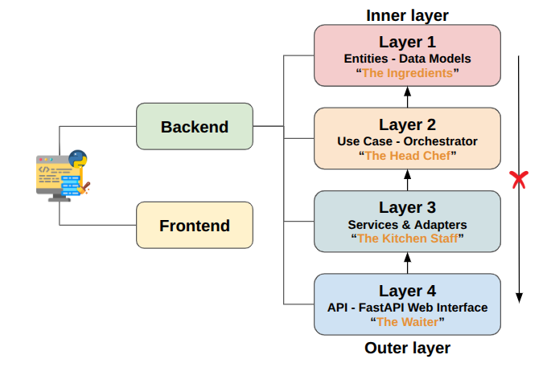

# CoMET-RS Backend

Metadata extraction for research software repositories (GitHub, GitLab), with maSMP and CodeMeta JSON-LD output.

<p align="center">
  
</p>

## Architecture

Four layers under `app/`:

| Layer | Location | Role |
|-------|----------|------|
| **1** | `app/layer_1/` | Domain models, schemas, provenance |
| **2** | `app/layer_2/use_cases/` | Orchestration (`ExtractMetadataUseCase`) |
| **3** | `app/layer_3/` | Extraction pipelines, steps, JSON-LD builder, FAIR evaluator |
| **4** | `app/layer_4/` | FastAPI routes, API schemas, response builders |

Layer 3 layout (high level):

- `steps/contracts/` — `StepContext`, `StepState`, `ExtractionPipeline`
- `steps/extract_steps/` — platform adapters, file parsers, external APIs
- `steps/merge_steps/software/` — merge candidates into `SoftwareMetadata`
- `composers/profiles/` — GitHub/GitLab × maSMP/CODEMETA pipelines
- `extraction_metadata/` — provenance collector and `record_field_provenance`
- `builders/jsonld_builder.py` — export `SoftwareMetadata` to JSON-LD

Full documentation: run `mkdocs serve` in this directory (see [Getting started](docs/getting-started.md)) or read the pages under `docs/`.

## Installation

```bash
pip install -r requirements.txt
```

## Run the API

```bash
uvicorn app.main:app --reload --host 0.0.0.0 --port 8000
```

- Swagger: http://localhost:8000/docs  
- Enriched metadata: `GET /api/metadata/enriched?repo_url=...&schema=maSMP`

## Run tests

```bash
pytest
```

## Documentation (MkDocs)

```bash
mkdocs serve
```

Open http://127.0.0.1:8002/ (port 8002 avoids clashing with the API on 8000).
